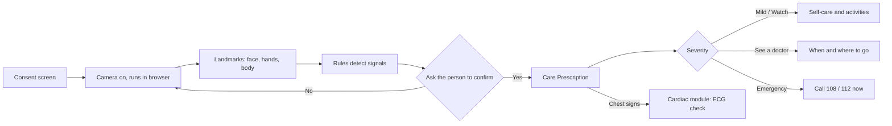

# Plan 003: Wellness Check Module

**Date:** 25 September 2026
**Status:** Brainstorm and design. Nothing built yet.
**Requested by:** project guide, as a second feature alongside the multimodal cardiovascular system.
**Principle:** it should always be helpful to everyone, including people with no medical data at all, only a phone camera.

## 1. What it is

A **Wellness Check** page on the Cardiac Nexus website. The person turns on their camera. The site watches body language and facial expression, asks how they feel, and gives a **Care Prescription**: what seems to be happening, how serious it is, how fast it usually gets better, and what to do.

It sits beside the main project, not instead of it, and it hands over to the cardiac module whenever the signs point to the heart.

## 2. What the camera looks for

| Signal | Likely meaning | Linked care guide |
| --- | --- | --- |
| Hand on forehead or temples | Headache | Headache |
| Fingers at the nose, sneezing, wiping the nose | Cold, allergy, runny nose | Cold and allergy |
| **Hand pressed on chest** | **Chest discomfort** | **Chest discomfort, hands over to the cardiac module** |
| Tears, downturned mouth, head lowered | Sadness or distress | Low mood |
| Frequent yawning, drooping eyelids | Tiredness | Fatigue and screen strain |
| Smiling | Positive mood | Encouragement, and confirms a mood activity worked |
| *(Stretch)* Pulse from subtle skin-colour change | Heart rate | Links to the ECG check if unusual |

The hand-on-chest signal is the bridge back to the cardiovascular project.

## 3. How it works

### Step by step

1. **Consent.** A clear screen: what the camera is used for, that nothing is recorded or uploaded, and a button to start. The camera never turns on by itself.
2. **Live view.** The camera feed with a light overlay of the tracked points, so the person sees what is being watched.
3. **Detection.** Simple, explainable rules on the tracked points, for example: *index fingertip within a set distance of the nose tip for at least one second.*
4. **Check-in, never assume.** *"It looks like your hand is on your head. Do you have a headache?"* with Yes / No / Something else. A facial expression is not proof of an emotion, so the person always confirms.
5. **Care Prescription** (section 4).
6. **Follow-up.** Mood activities where relevant, a download of the prescription, and a reminder to check again later.

## 4. The Care Prescription

Styled like a prescription slip. It answers the three questions people actually have: what is happening, is it bad, and how fast will it get better.

| Field | Content |
| --- | --- |
| What's happening | The likely everyday cause, in plain words, with the signal that triggered it |
| How serious | 🟢 Mild · 🟡 Watch it · 🟠 See a doctor · 🔴 Emergency |
| How fast it usually gets better | A typical recovery time for the common, harmless cause |
| What to do now | Practical steps: rest, fluids, breaks, breathing, posture, steam and so on |
| Medicines | General wording only, for example *"Pain relief is available over the counter. Ask a pharmacist which suits you."* No drug names or doses |
| See a doctor if | Clear warning signs that change the advice |
| Footer | *Guidance, not a medical prescription. If you are worried, see a doctor.* |

### Why no drug names or doses

- The same tablet can be safe for one person and harmful for another. A camera cannot know age, pregnancy, allergies, liver or kidney problems, or other medicines.
- In India only a registered medical practitioner may prescribe. The Telemedicine Practice Guidelines (2020) do not allow software to issue prescriptions.
- Everything else a prescription gives, which is most of what helps with everyday problems, can be provided safely.

The draft content for each condition is in [003a_care_prescription_content.md](003a_care_prescription_content.md). It must be reviewed by a doctor or the project guide before it is shown to anyone.

## 5. Making people feel better

When low mood is detected and confirmed, the site offers choices rather than forcing one:

- **Breathing exercise:** an animated circle, breathe in 4 s, hold 4 s, out 4 s, hold 4 s.
- **Mood lift:** calming music, a gratitude prompt, or a light, funny clip.
- **Talk to someone:** India's national mental health helpline **Tele-MANAS, 14416**, free and available 24 hours.
- **Smile check:** at the end, the camera notices a smile and says so.

## 6. Technology

All in the browser, so no backend is needed and it fits the current frontend.

| Need | Tool |
| --- | --- |
| Face points and expressions | MediaPipe **Face Landmarker**: 478 face points and 52 expression scores ("blendshapes" such as smile, frown, brow lowered) |
| Hand positions | MediaPipe **Hand Landmarker**: 21 points per hand |
| Body posture | MediaPipe **Pose Landmarker**: head down, slumped, hand on chest |
| Pulse (stretch) | **rPPG** (remote photoplethysmography): heart rate from tiny colour changes in facial skin |
| Care content | A reviewed JSON knowledge base, no AI-generated medical text |
| Prescription download | Browser-generated PDF |

MediaPipe runs on the device through WebAssembly and WebGL, so video frames never leave the phone or laptop.

### Explainability

Every result says why: *"Flagged headache: your hand rested on your forehead for 3 seconds and your brows were lowered."* This matches the explainability approach of the cardiac models.

## 7. Safety and privacy principles

1. **Privacy first.** On-device only. Nothing recorded, stored or uploaded. The person starts and stops the camera.
2. **Ask, don't assume.** Detection leads to a question, never a verdict.
3. **Guide, don't diagnose or prescribe.** Care guidance only, with clear escalation.
4. **Emergencies override everything.** Red-flag signs immediately show **108 (ambulance) / 112 (emergency)**.
5. **Honest limits on screen.** Lighting, camera quality and skin tone affect accuracy, and the page says so.

## 8. Visible disease signs (stretch goal, with caution)

Detecting skin conditions, jaundice or pallor from a webcam is unreliable: lighting and cameras change skin colour, and skin-condition models are known to perform worse on darker skin tones, which matters for Indian users. If built at all, it should be an **"upload a clear photo"** option that only says *"this may be worth showing a doctor"*, never a diagnosis.

## 9. Build phases

| Phase | Scope | Difficulty |
| --- | --- | --- |
| 1 | Consent screen, camera, gestures: head, nose, chest | Easy to medium |
| 2 | Expressions with the check-in question | Medium |
| 3 | Care Prescription engine and downloadable slip | Easy |
| 4 | Mood activities: breathing, helpline, smile check | Easy |
| 5 | Camera pulse (rPPG), linked to the ECG module | Hard |
| 6 | Photo-based visible signs | Stretch, with the caveats in section 8 |

Phases 1 to 4 need no backend.

## 10. How we will test it

- **Gesture accuracy.** Each team member acts out each gesture several times, in good and poor lighting. Record how often each is detected, and how often it is detected when nothing is happening (false alarms).
- **Care content review.** The project guide or a doctor reviews every Care Prescription before it goes live.
- **Pulse check (if phase 5 is built).** Compare camera pulse against a fingertip pulse oximeter, sitting still, in good light.

Results will be written up as an experiment record, like the cardiac experiments.

## 11. Open questions for the team

- Should the camera check also be offered on the dashboard after a cardiac analysis?
- Who reviews the medical content: the project guide, or a doctor they can refer us to?
- Which languages beyond English? Kannada and Hindi would widen who it helps.
